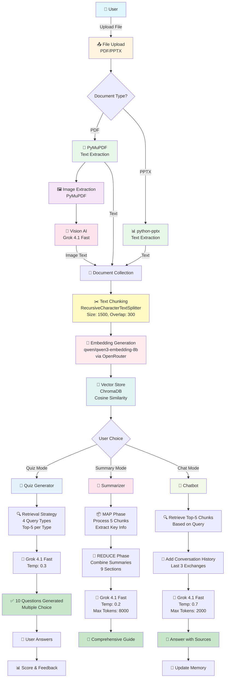
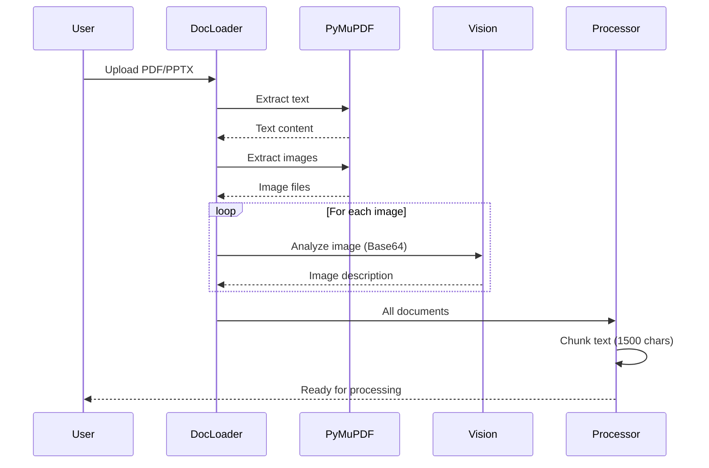
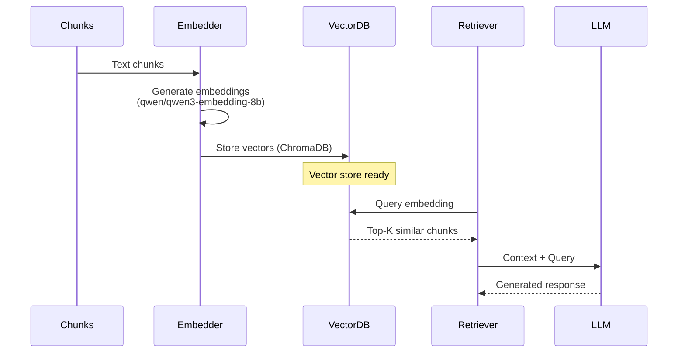
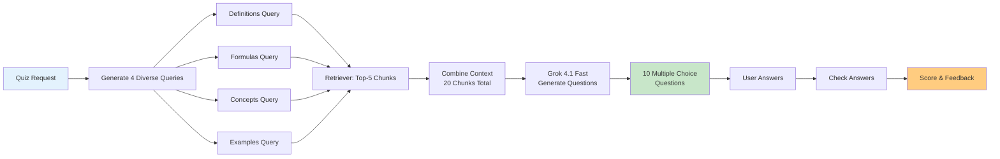
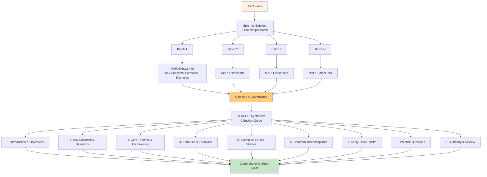
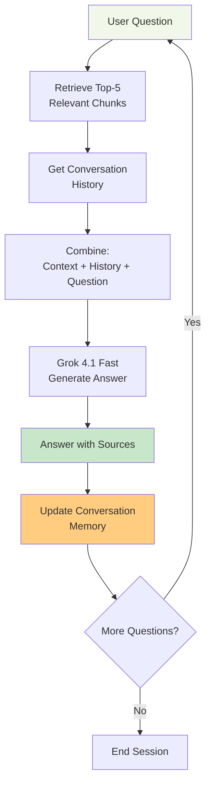
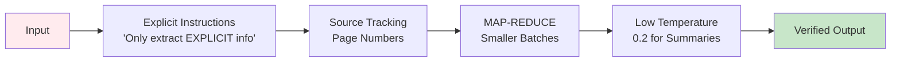
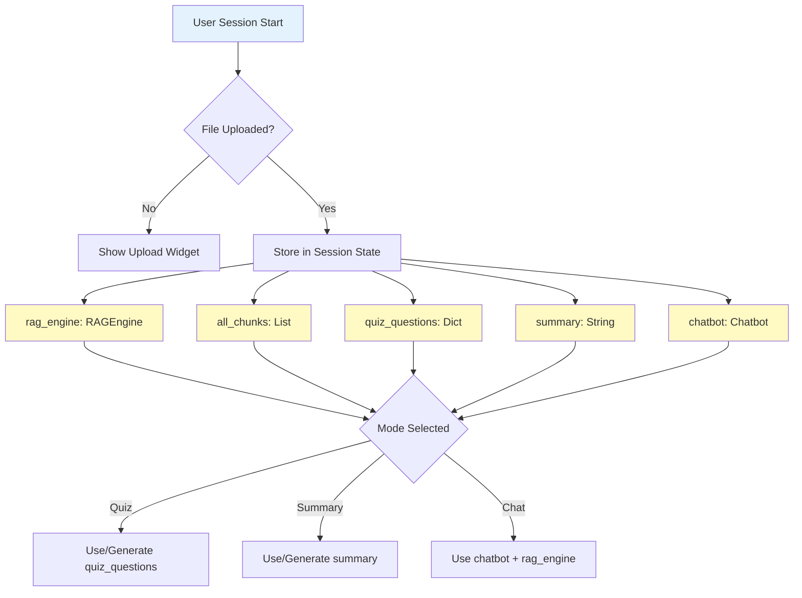
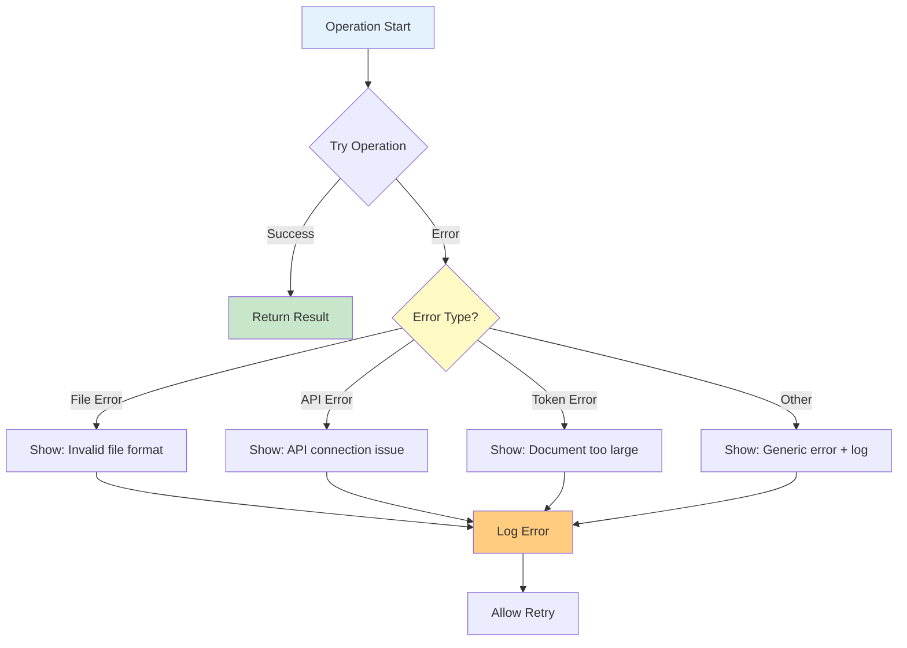

# ResumeCour Pipeline Diagram

## Complete System Workflow

Below is the complete data flow and processing pipeline for the ResumeCour AI Study Assistant.

## Detailed Component Flow

### 1. Document Processing Pipeline

### 2. RAG Engine Pipeline

### 3. Quiz Mode Pipeline

### 4. Summary Mode Pipeline (MAP-REDUCE)

### 5. Chat Mode Pipeline

## Key Technical Specifications

### Models Used
| Component | Model | Provider | Purpose |
|-----------|-------|----------|---------|
| Text Generation | x-ai/grok-4.1-fast | OpenRouter | Quiz, Summary, Chat |
| Vision Analysis | x-ai/grok-4.1-fast | OpenRouter | Image understanding |
| Embeddings | qwen/qwen3-embedding-8b | OpenRouter | Semantic search |

### Processing Parameters
| Parameter | Value | Purpose |
|-----------|-------|---------|
| Chunk Size | 1500 chars | Optimal context window |
| Chunk Overlap | 300 chars | Prevent info loss |
| Batch Size (Summary) | 5 chunks | Token optimization |
| Top-K Retrieval | 5 documents | Balance precision/recall |
| Temperature (Quiz) | 0.3 | Balanced creativity |
| Temperature (Summary) | 0.2 | High accuracy |
| Temperature (Chat) | 0.7 | Conversational |

### Performance Metrics
| Operation | Time | Tokens |
|-----------|------|--------|
| Document Upload & Process | 30-60s | - |
| Image Analysis (per image) | 5-10s | 500-1k |
| Quiz Generation | ~30s | 3k-5k |
| Summary Generation | 1-2min | 15k-25k |
| Chat Response | 3-5s | 1k-2k |

## Anti-Hallucination Measures

## Session State Management

## Error Handling Flow

---

**Legend:**
- 🔵 Blue: User interaction
- 🟢 Green: Successful output
- 🟡 Yellow: Processing stage
- 🟠 Orange: Decision point
- 🔴 Red: AI model inference

